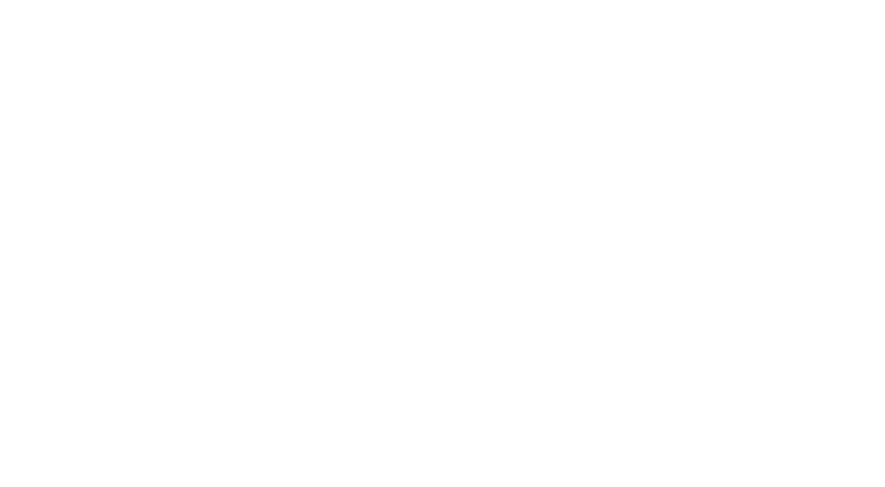

::: {.reveal}
::: {.slides}
::: {.section data-background-image="meadow-3840x2160-4k-hd-wallpaper-field-plant-background-448.jpg"}
DataChallenge & {#datachallenge .r-fit-text}
---------------

::: {style="display: grid; grid-template-columns: 60% 30%;"}

Hackdays {#hackdays .r-fit-text}
--------

:::

::: {style="background-color: rgba(242, 188, 107,0.6); width: 100%; padding: 10px; border-radius:20px"}
(click for more information)
:::
:::

::: {.section}
### What is this about?

\
\

::: {style="font-size:smaller"}
The [Research Group for
Geoinformatics](https://www.zhaw.ch/de/lsfm/institute-zentren/iunr/geooekologie/geoinformatik/)
is organizing a DataChallange and subsequent hackdays in perticular for
bachelor and master students at ZHAW LSFM who are interested of honing
their datascience skills on a fun, small project.
:::
:::

::: {.section}
### How does it work?

[]{.small}

::: {.about-card .fragment .fade-in-then-semi-out}
We provide you with an interesting dataset. You use your coding skills
(beginners welcome!) to do an exploratory analysis and come up with an
idea on what you want to further explore with this data.
:::

::: {.about-card .fragment .fade-in-then-semi-out}
This could be answering specific research questions, creating a cool
visualiation or something else. You submit this idea individually or in
teams by 9^th^ June 2022 thus taking part in the *DataChallange*
:::

::: {.about-card .fragment .fade-in-then-semi-out}
You will pitch your idea on the 10^th^ of June and listen to ideas
presented by your fellow students after which you can either continue to
work on your own idea or form teams with like minded participants.
:::

::: {.about-card .fragment .fade-in-then-semi-out}
You or your team will work on this idea during the *Hack Days* on the
20^th^, 21^st^ and 22^nd^ June 2023. After completion and submition we
will vote on the best implementation, thus anointing *the winner of the
2022 Hackdays\@N*
:::
:::

::: {.section}
### What you will gain

-   Sharpen your datascience skills
-   Learn state-of-the-art collaboration via git
-   Participate in a friedly competition
-   Earn 1 ETCS playfully^1^

::: {style="padding-top: 40px; font-size: small; bottom: 0px; right: 0px; text-align: right"}
^1^This excludes participants of the FS2022 Course *Computational
Movement Analysis* / *Patterns & Trends in Environmental Data*
:::
:::

::: {.section}
### interested?

Register to this event via [this
link](https://github.com/DataChallenge-N/FS22/issues/new?labels=&template=registration.md)\
\
[Registration is non-binding and requires registering for a github
account.]{.small}\
\
[Question can be directed @ [Nils
Ratnaweera](https://www.zhaw.ch/en/about-us/person/rata/)]{.small}
:::

::: {.section data-background-image="Technology-Background-HD-Image.jpg"}
### Looking forward to seeing you!
:::
:::
:::
